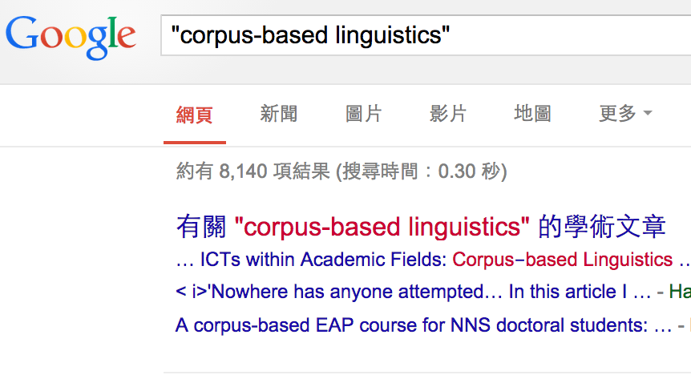
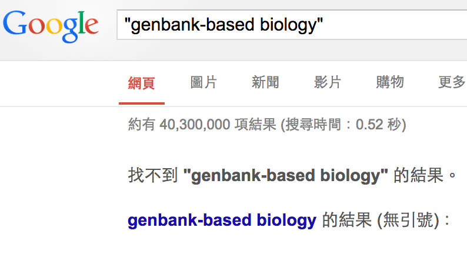

-----------------------------

## 理念

#### 在語言學界，存在已久的誤會。


----------------------------


* 為了補上台灣語料庫語言學的資源缺口。
* 內容共享，工具共創 ，製程 know-how 開放。
* 孵育（1）標記與分析（2）系統與開發人才（給語言學生進入國內/國際業界做暖身）


----------------------------

## 語料庫是什麼

**語料** (linguistic data) 的概念如果被現在接受的 **語料庫裡的資料** (corpus data) 限制住，戲就難唱下去了。

* 工具，物件與觀察角度 

The relationships among the *observables, the methods of observation*, and *the theoretical constructs* turn out to be a battleground between different approaches to corpus studies. 

激進一點的科學哲學的觀點：沒有中立的、理論無害的語料。 

"theoretically innocuous" method in science - that is, the question of whether there exists any such thing as a direct observation which leaves no imprint on representations of the observed phenomena.

* （亂入）就算 armchair linguists 腦中的思想也可以變成語料庫。[unBox the Chomsky Archive](http://libraries.mit.edu/chomsky/)

* （續亂入）就算只想找「錯」的語料的人，也需要一個「只放對的語料」的語料庫。


----------------------------

## 語料庫語言學是什麼





Should corpus linguistics be viewed as a **theory** or theory-independent **methodology (or set of methodology)** ? $\rightarrow$ The relation between Theory and Data has been identified as *the main points of tension in corpus linguistics*.


最一致的回答：

> No consensus among linguists as to what corpus linguistics actually is.

回應：

> corpus linguistics should be viewed as a theory-independent methodology (or set of methodology), where the methodological aspects are wedded to a number of theoretical assumptions about what language is.

> 我們可以把它當成是關照資料與理論互動的學問，應用上是語言學與其他學門之間的`經驗接口`。

### 現在的語料庫，有事嗎？

* 不好玩。~~（看不到我作夢時看到的東西）~~
* 不開放。（資料難交換 incompatible，研究難重製 irreproducible）
* 缺永續經營規劃。


----------------------------

## COPENS, 語料庫系統的超展開


### 特色

- Focused web crawling 
- 延續台灣語料庫語言學史上最珍貴的詞類標記
- 結合大詞庫訊息的多元語料搜尋標記與統計系統
- 


### 搜尋工具該有的都有

- CQL-supported query
- Concordance (KWIC)
- Collocations
- Grammatical Sketch
- Thesaurus
- Sentiment
- User's own corpus
- . . . . . .


### 語料庫基本訊息


```{r, echo=FALSE}
library(zipfR)
copens <- read.csv("~/LOPEN/COPENS/COPENS.workshop/fdist_all.csv")
names(copens) <-c("WORD", "RAW", "FREQ")
copens.tbl <- copens[1:2]
copens.vec <- copens[1:137874,2]
copens.tfl <- vec2tfl(copens.vec)
copens.spc <- vec2spc(copens.vec)
copens.vgc <- vec2vgc(copens.vec)
#Vm(copens.spc, 1:5)
#N(copens.spc)
#V(copens.spc)

```

#### Frequency spectrum

```{r}
summary(copens.spc)
sum(copens[2])  # num. of tokens 
```


```{r, echo=FALSE}
plot(copens.spc)
```


### 還可以使用 API 優

混搭別的 bosannlp

```{r engine='python'}

```


## COPENS/PTT-based analysis

### 言談與文本分析：搜尋與標記

* Political discourse marker, text edidentiality
* Lexical bundles and emergent constructions with advanced query
* Writing strategies, coherence relations with `Brat` annotation


### 社會語言網路中的變異與變遷

* Variation and Change
* PTT and Social Network Analysis

`從「殺很大」 到 「神助攻」`


## Future (*after*-) works 

未來的（下班後）工作

* 開放製程（書放在 [Gitbook](http://loperntu.gitbooks.io/copens/)）。
* 開放演算法（**眾算**）與接口模組設計。
* 樣本貢獻 credit （開放語料市集）。
* 開放政府「還語於民」運動。
* 跨界合作：語料庫與人文社會科學；語料庫與公民黑客。
* 語料庫與計算語言學課程期末計畫合作。


